<!-- generated with
     ░░░░░░░░░░░░░░░░░░░░░░░░░░░░░░░░░░░░░░░░░░░░░░░
     ░░█▀▄▀█ ▄▀█ █▀█ █▄▀ █░█ █▀█ ░ ░░█ █▀ █▀█ █▄░█░░
     ░░█░▀░█ █▀█ █▀▄ █░█ █▄█ █▀▀ ▄ █▄█ ▄█ █▄█ █░▀█░░
     ░░ github.com/metaory/markup.json ░░░░░░░░░░░░░ -->

  
   
  <b>
    Principal // Platform SWE
  </b>
  

    Solution Architect # AWS
  

  <b>
    ::JS·SH·Lua·JQ::
  </b>
   
  <b>
    Arch·X11·AWM·Tmux·nVim
  </b>
   
  
   
  <strong>
    16+ years building
  </strong>
   
  <small>
    full-stack, distributed platforms
  </small>
   
  <small>
    and cloud architecture
  </small>
  

<h4
  align="center"
>
  Personal Projects
</h4>
<li>
  
  
  <a
    href="https://github.com/metaory/ascii-lab"
  >
    <strong>
      ascii-lab
    </strong>
  </a>
  <a
    href="https://metaory.github.io/ascii-lab/"
  >
    [LIVE]
  </a>
  <i>
    ─
    experimental ASCII art effects
  </i>
  
  <b>
    7
  </b>
</li>
<li>
  
  
  <a
    href="https://github.com/metaory/markon"
  >
    <strong>
      markon
    </strong>
  </a>
  <a
    href="https://metaory.github.io/markon/"
  >
    [LIVE]
  </a>
  <i>
    ─
    Minimal distraction-free live Markdown editor
  </i>
  
  <b>
    32
  </b>
</li>
<li>
  
  
  <a
    href="https://github.com/metaory/coloruv"
  >
    <strong>
      coloruv
    </strong>
  </a>
  <a
    href="https://metaory.github.io/coloruv/"
  >
    [LIVE]
  </a>
  <i>
    ─
    a minimal natural color picker
  </i>
  
  <b>
    6
  </b>
</li>
<li>
  
  
  <a
    href="https://github.com/metaory/bit-grid-component"
  >
    <strong>
      bit-grid-component
    </strong>
  </a>
  <a
    href="https://metaory.github.io/bit-grid-component/"
  >
    [LIVE]
  </a>
  <i>
    ─
    Framework-agnostic web component for boolean matrices
  </i>
  
  <b>
    6
  </b>
</li>
<li>
  
  
  <a
    href="https://github.com/metaory/nyaa-cli"
  >
    <strong>
      nyaa-cli
    </strong>
  </a>
  <undefined />
  <i>
    ─
    CLI for automated anime torrent downloads with stateful episode tracking, quality filters, and uploader selection
  </i>
  
  <b>
    21
  </b>
</li>
<li>
  
  
  <a
    href="https://github.com/metaory/glitcher-app"
  >
    <strong>
      glitcher-app
    </strong>
  </a>
  <a
    href="https://metaory.github.io/glitcher-app/"
  >
    [LIVE]
  </a>
  <i>
    ─
    Turn text or images into animated glitches // SVG • WebM • GIF
  </i>
  
  <b>
    82
  </b>
</li>
<li>
  
  
  <a
    href="https://github.com/metaory/gradient-gl"
  >
    <strong>
      gradient-gl
    </strong>
  </a>
  <a
    href="https://metaory.github.io/gradient-gl/"
  >
    [LIVE]
  </a>
  <i>
    ─
    Tiny WebGL library for Deterministic seed-driven Procedural Gradient Animations
  </i>
  
  <b>
    43
  </b>
</li>
<li>
  
  
  <a
    href="https://github.com/metaory/shadertoy2webgl"
  >
    <strong>
      shadertoy2webgl
    </strong>
  </a>
  <undefined />
  <i>
    ─
    CLI and library to convert ShaderToy shaders to standalone WebGL2 applications with uniform handling and zero dependencies
  </i>
  
  <b>
    3
  </b>
</li>
<li>
  
  
  <a
    href="https://github.com/metaory/noseyparker-compact"
  >
    <strong>
      noseyparker-compact
    </strong>
  </a>
  <undefined />
  <i>
    ─
    CLI tool to transform verbose noseyparker JSON reports into concise JSON or CSV summaries for security analysis
  </i>
  
  <b>
    4
  </b>
</li>
<li>
  
  
  <a
    href="https://github.com/metaory/glslmine"
  >
    <strong>
      glslmine
    </strong>
  </a>
  <a
    href="https://metaory.github.io/glslmine/"
  >
    [LIVE]
  </a>
  <i>
    ─
    Modern GLSL shader gallery with auto-fetch from GLSL Sandbox and Shadertoy, featuring smart filters and minimal interface
  </i>
  
  <b>
    20
  </b>
</li>
<li>
  
  
  <a
    href="https://github.com/metaory/xvoid"
  >
    <strong>
      xvoid
    </strong>
  </a>
  <undefined />
  <i>
    ─
    a minimal, distraction-free new tab cosmic void experience
  </i>
  
  <b>
    2
  </b>
</li>
<li>
  
  
  <a
    href="https://github.com/metaory/source-map-visualization"
  >
    <strong>
      source-map-visualization
    </strong>
  </a>
  <a
    href="https://metaory.github.io/source-map-visualization/"
  >
    [LIVE]
  </a>
  <i>
    ─
    [FORK] an unholy sourcemap visualization tool
  </i>
  
  <b>
    3
  </b>
</li>
<li>
  
  
  <a
    href="https://github.com/metaory/glitcher-cli"
  >
    <strong>
      glitcher-cli
    </strong>
  </a>
  <undefined />
  <i>
    ─
    Bash CLI to generate animated pseudo-random glitch SVG effects from ASCII characters with randomized parameters
  </i>
  
  <b>
    91
  </b>
</li>
<li>
  
  
  <a
    href="https://github.com/metaory/junk-activity-scanner"
  >
    <strong>
      junk-activity-scanner
    </strong>
  </a>
  <undefined />
  <i>
    ─
    Automated GitHub repository scanner that evaluates and reports bot-generated junk repositories using multi-language evaluators
  </i>
  
  <b>
    5
  </b>
</li>
<li>
  
  
  <a
    href="https://github.com/metaory/jsonresume-theme-legacy"
  >
    <strong>
      jsonresume-theme-legacy
    </strong>
  </a>
  <a
    href="https://metaory.github.io/jsonresume-theme-legacy/"
  >
    [LIVE]
  </a>
  <i>
    ─
    Legacy JSONResume Iconify, colors, PDF
  </i>
  
  <b>
    14
  </b>
</li>
<li>
  
  
  <a
    href="https://github.com/metaory/markup.json"
  >
    <strong>
      markup.json
    </strong>
  </a>
  <undefined />
  <i>
    ─
    A minimal markup DSL and AST for JSON - Transforms into HTML, SVG or XML-like output via CLI or JS library
  </i>
  
  <b>
    17
  </b>
</li>
<li>
  
  
  <a
    href="https://github.com/metaory/pcall.js"
  >
    <strong>
      pcall.js
    </strong>
  </a>
  <undefined />
  <i>
    ─
    Minimal Result/Monad library inspired by Lua pcall, Elixir Result, and Rust Result with lifecycle hooks and zero dependencies
  </i>
  
  <b>
    5
  </b>
</li>
<li>
  
  
  <a
    href="https://github.com/metaory/xico"
  >
    <strong>
      xico
    </strong>
  </a>
  <undefined />
  <i>
    ─
    Minimal CLI utility to generate SVG or PNG images from single Unicode characters or templates, ideal for icon and glyph creation
  </i>
  
  <b>
    8
  </b>
</li>
<li>
  
  
  <a
    href="https://github.com/metaory/hexocd-colorscheme"
  >
    <strong>
      hexocd-colorscheme
    </strong>
  </a>
  <undefined />
  <i>
    ─
    An OCD handwritten Colorscheme
  </i>
  
  <b>
    2
  </b>
</li>
<li>
  
  
  <a
    href="https://github.com/metaory/confsubst"
  >
    <strong>
      confsubst
    </strong>
  </a>
  <undefined />
  <i>
    ─
    POSIX-compliant templating CLI with modeline syntax, environment variable substitution, and pre/post hooks for configuration management
  </i>
  
  <b>
    2
  </b>
</li>
<li>
  
  
  <a
    href="https://github.com/metaory/zsh-roundy-prompt"
  >
    <strong>
      zsh-roundy-prompt
    </strong>
  </a>
  <undefined />
  <i>
    ─
    minimal • roundy prompt for ZSH in 140 lines
  </i>
  
  <b>
    52
  </b>
</li>
<li>
  
  
  <a
    href="https://github.com/metaory/mxflow-cli"
  >
    <strong>
      mxflow-cli
    </strong>
  </a>
  <a
    href="https://npmjs.com/package/mxflow"
  >
    [LIVE]
  </a>
  <i>
    ─
    General purpose task runner
  </i>
  
  <b>
    10
  </b>
</li>
<li>
  
  
  <a
    href="https://github.com/metaory/xtmux"
  >
    <strong>
      xtmux
    </strong>
  </a>
  <undefined />
  <i>
    ─
    ▼ dark minimal tmux setup
  </i>
  
  <b>
    16
  </b>
</li>
<li>
  
  
  <a
    href="https://github.com/metaory/mxcolr"
  >
    <strong>
      mxcolr
    </strong>
  </a>
  <undefined />
  <i>
    ─
    ヘ Generate, Preview and Apply beautiful unified human friendly pseudo random color schemes, SYSTEM WIDE!
  </i>
  
  <b>
    24
  </b>
</li>

  <h3>
    🔸stuff I aspire🔸
  </h3>
  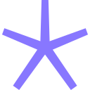
  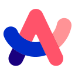
  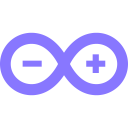
  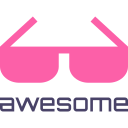
  
  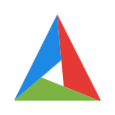
  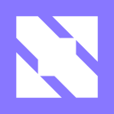
  
  
  
  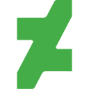
  
  
  
  
  
  
  
  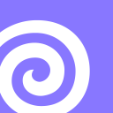
  
  
  
  
  
  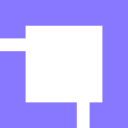
  
  
  
  
  
  
  
  
  
  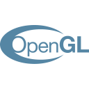
  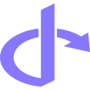
  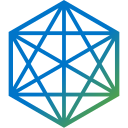
  
  
  
  
  
  
  
  
  
  
  
  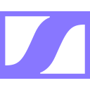
  
  
  
  
  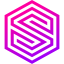
  
  
  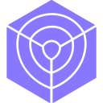
  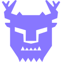
  
  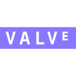
  
  
  
  
  
  
  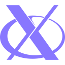
  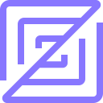
  
  

  

  <h3>
    🔹stuff I regularly use🔹
  </h3>
  
  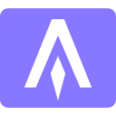
  
  
  
  
  
  
  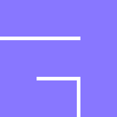
  
  
  
  
  
  
  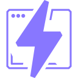
  
  
  
  
  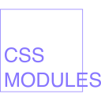
  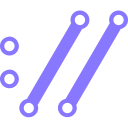
  
  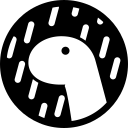
  
  
  
  
  
  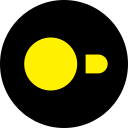
  
  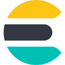
  
  
  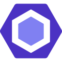
  
  
  
  
  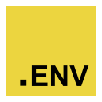
  
  
  
  
  
  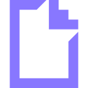
  
  
  
  
  
  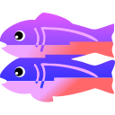
  
  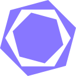
  
  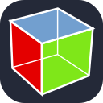
  
  
  
  
  
  
  
  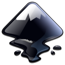
  
  
  
  
  
  
  
  
  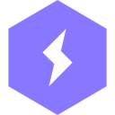
  
  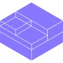
  
  
  
  
  
  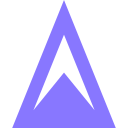
  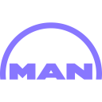
  
  
  
  
  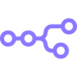
  
  
  
  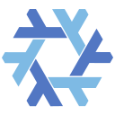
  
  
  
  
  
  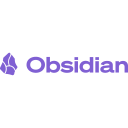
  
  
  
  
  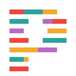
  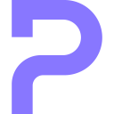
  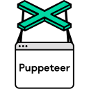
  
  
  
  
  
  
  
  
  
  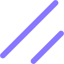
  
  
  
  
  
  
  
  
  
  
  
  
  
  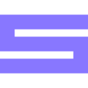
  
  
  
  
  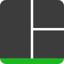
  
  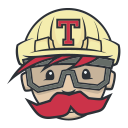
  
  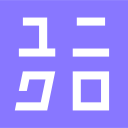
  
  
  
  
  
  
  
  
  
  

  

  <h3>
    🔺stuff I moderately tolerate🔺
  </h3>
  
  
  
  
  
  
  
  
  
  
  
  
  
  
  
  
  
  
  
  
  
  
  
  
  
  
  
  
  
  
  
  
  
  
  
  
  
  
  
  
  
  
  
  
  
  
  
  
  
  
  
  
  
  
  
  
  
  
  
  
  
  
  
  
  
  
  
  
  
  
  
  
  
  
  
  
  
  
  
  
  
  
  
  
  
  
  
  
  
  
  
  
  
  
  
  
  
  
  
  
  
  
  
  
  
  
  
  
  
  
  
  
  

  

  <h3>
    🔻stuff I actively avoid🔻
  </h3>
  
  
  
  
  
  
  
  
  
  
  
  
  
  
  
  
  
  
  
  
  
  
  
  
  
  
  
  
  
  
  
  
  
  
  
  
  
  
  
  
  
  
  
  
  
  
  
  
  
  
  
  
  
  
  
  
  
  
  
  
  
  
  
  
  
  
  
  
  
  
  
  
  
  
  
  
  
  
  
  
  
  
  
  
  
  
  
  
  
  
  
  

  

  
    <i>
      <a
        href="README.sh"
      >
        README.sh
      </a>
      generated this readme with
      <a
        href="https://github.com/metaory/markup.json"
      >
        markup.json
      </a>
    </i>
  
   
  <kbd>
    updated @1763000000
  </kbd>

